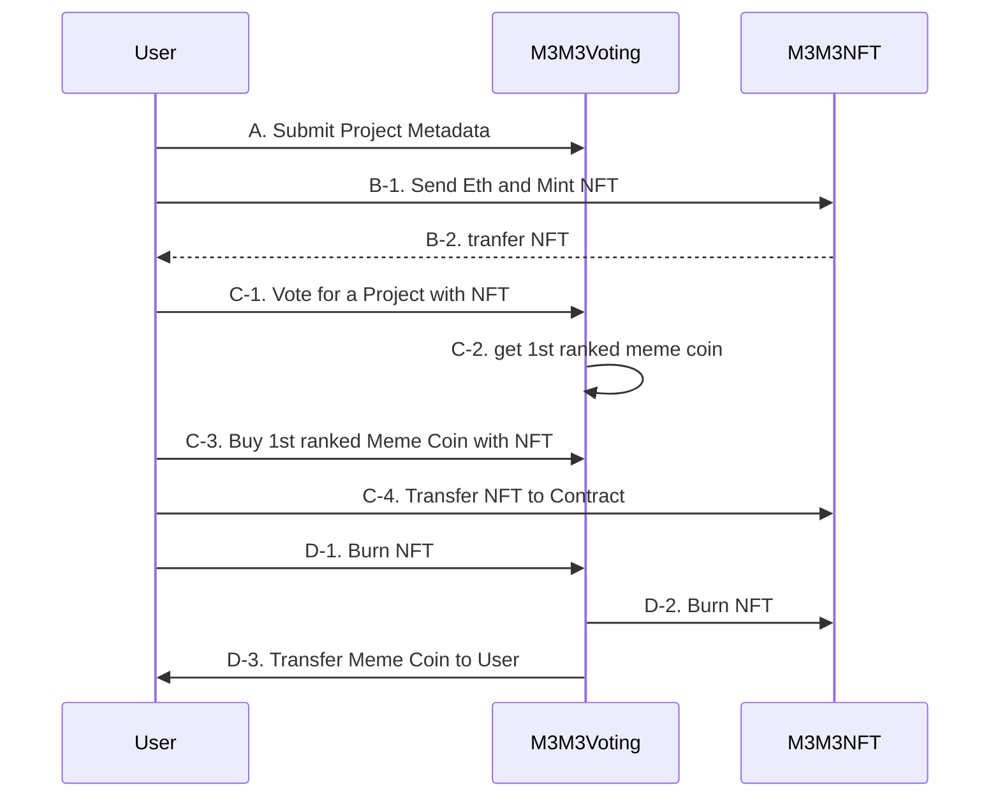

# M3M3 DAO

# Demo
https://m3m3dao.github.io/webapp/

# Contract Repo
https://github.com/M3M3DAO/m3m3-contract

# Frontend Repo
https://github.com/M3M3DAO/webapp

# Explain
Project Usese React, and solidity to make a system. We make UI and UX simple to make user easy to particiapte. User could send Ethereum and min NFT that could be worked as an vote method. When user gets nft to votes they could vote with nft according to their voted numbers. Anyone could register project to proposals and all the data is recorede to smart contract. User could buy 1st ranked project meme coin. Buying means burn nft and get erc20 tokens.

# Demo
https://m3m3dao.github.io/webapp/

# Contract Repo
https://github.com/M3M3DAO/m3m3-contract

# Contract Address 

(Arbitrum)
```
NFT: 0x714eD56B2dA2f6CF4A583507bF3CF15313989E1B
Vote: 0xd0cF7C434bbA6Ae95e9580ea0dC3020255D2fBa1
```
(Avail)
```
NFT: 0x714eD56B2dA2f6CF4A583507bF3CF15313989E1B
Vote: 0xE54b29c5ee96Be7893374650Ee29bA6B682714b7
```
# verified in Scan (Avail)
https://op-avail-sepolia-explorer.alt.technology/address/0x714eD56B2dA2f6CF4A583507bF3CF15313989E1B?tab=contract

https://op-avail-sepolia-explorer.alt.technology/address/0xE54b29c5ee96Be7893374650Ee29bA6B682714b7?tab=contract

# Sequance Diagram



# Contract Architecture

